# Voice-to-Data Structured Capture

Turns a director's spoken or transcribed quarterly update into a schema-conformant **DRAFT** — marked as not a final record — for a human to review, correct and approve before a (mocked) write to the system of record. Built on Pydantic, `httpx`, `rapidfuzz`, Streamlit; reaches `gpt-5.4-mini` and `whisper-1` through OpenRouter.

## Architecture



Green = built here; amber dashed = proposed production concerns, detailed below.

## Running it

```bash
python3 -m venv .venv && source .venv/bin/activate
pip install -r requirements-dev.txt
cp .env.example .env                 # add OPENROUTER_API_KEY to process updates
pytest                               # full suite, offline, no key needed
streamlit run streamlit_app.py       # opens in your browser
python run_samples.py                # the six required cases (+ audio) against the live API, results in results/*.json
```

## Key architecture decision: the model reports, deterministic code decides

The LLM never returns a final value — only a loose per-field *report* (status, raw words, evidence quote). `field_decisions.py` turns that into the strict schema — controlled vocabulary, integer ranges, 200-char limits, quote checked against the transcript — in deterministic, unit-tested code the model can't influence. `drafting.py`'s `create_draft()` is the single pipeline driver, used by both the UI and `run_samples.py`.

## Guardrails implemented

- **Four field statuses**, not two — `EXTRACTED`/`EXPLICITLY_NONE`/`MISSING`/`AMBIGUOUS`. "Never mentioned" ≠ "declined" ≠ "invalid".
- **Evidence grounding** — every quote checked against the transcript before trust; unsupported → `AMBIGUOUS`.
- **Nothing invented** — `FieldResult.value` is non-null only when `EXTRACTED`, true by construction.
- **Prompt-injection resistant** — a live test (`data/examples/prompt_injection.txt`) never accepted the injected values; a blocking `POSSIBLE_INJECTION` flag forces review regardless.
- **Self-corrections/hedged numbers** resolve to the final value, or stay `AMBIGUOUS` if unsettled.

## Fit into ILRI's Microsoft 365 / Azure architecture

Streamlit's submit/review tabs stand in for Microsoft Forms or a Teams upload plus a Power Automate approval step; Power BI would read the resulting SharePoint list.

## What was deliberately not built, and where each production concern is handled instead

Persistence (in-memory only) and rate limiting/request queuing aren't built either — a single-reviewer local demo doesn't need them; production adds a database behind the existing `Draft`/`ApprovedRecord` shapes and a task queue once usage passes one reviewer at a time. Everything else the brief asks to be indicated:

- **Authentication** — not built; today anyone with the URL can open the app, no identity check at all. Production: the Streamlit app sits behind Entra ID / M365 SSO (Azure App Service "Easy Auth" or an equivalent reverse-proxy authenticator), so every request carries a verified ILRI identity before it reaches `create_draft()` or `approve_draft()`.
- **Authorization / least-privilege access** — not built; there's no concept of roles, so the same person can submit and approve their own update unreviewed. Production: authorization is separate from authentication — ILRI AD/Entra group membership maps to "can submit" vs "can approve" scopes, checked on every request, not just at login.
- **Secrets management** — `.env` (git-ignored, never logged) today; Azure Key Vault, referenced via managed identity, in production. Same principle for data residency: OpenRouter (third-party) today; Azure OpenAI direct, inside ILRI's tenant, in production.
- **Logging** — not built beyond default stdout. Production: structured JSON logs per pipeline stage (submit/transcribe/extract/decide/review/approve/write), one correlation ID per draft so a single update is traceable end to end, shipped to Azure Monitor. Transcript content is excluded by default (speaker-supplied, potentially sensitive) — only status/verdict/flag codes and timings are logged.
- **Monitoring** — not built. Production: OpenRouter error rate, latency, `READY_FOR_REVIEW`/`NEEDS_ATTENTION` split as a quality signal.
- **Auditability** — **built**: the list-item write (`write_to_sharepoint()`) contains only the six schema fields, matching what a real SharePoint list write would look like; `ai_values`, `field_statuses` and `approved_at` go to a separate companion audit record (`*_audit.json`) linked by ID, not extra columns on the list item. Gap: there's no reviewer *identity* on that record today, since there's no auth to attach one to (`approved_at` recorded, `approved_by` isn't) — production adds that once auth exists.
- **Human approval** — **built and enforced**: `approve_draft()` refuses any blocked/flagged field until explicitly confirmed or changed — tested in `test_approval.py`/`test_streamlit_app.py`. Nothing reaches the write path unconfirmed.
- **System-of-record write** — **built as a mock**: `write_to_sharepoint()` is the single, isolated function writing JSON standing in for a Graph API write to `Quarterly_Updates` — a one-function swap in production.

## Dependencies, cost and tests

Five runtime packages (`pydantic`, `httpx`, `rapidfuzz`, `python-decouple`, `streamlit`); `pytest` dev-only. Two paid calls per update, uncapped. `tests/` has 98 offline tests; `run_samples.py` writes `{case}_structured.json` (schema + flag messages) and `{case}_field_wise.json` (full detail) per case. See [Engineering Notes](docs/ENGINEERING_NOTES.md).
